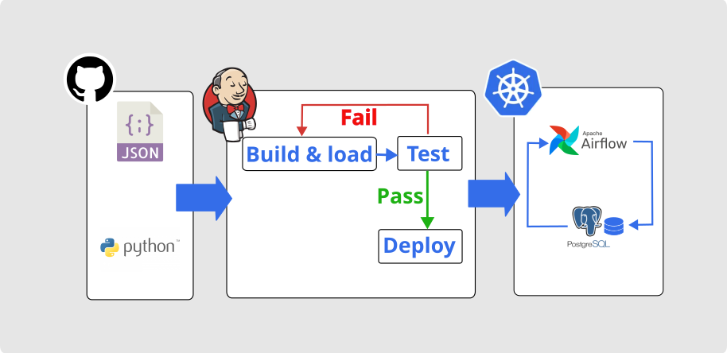

# Jenkins-CICD-K8S-Airflow
Automate CI/CD Pipeline using Jenkin to Airflow on Kubernetes

# *Overview*
Automate CI/CD Pipeline Airflow DAG using Jenkins, Airflow DAG is tested everytime build before deploy into Airflow on Kubernetes. The workflow using Github repository, using push event to trigger Jenkins to start build process, the code start load --> test --> deploy. Only pass test will deploy into production, if fail continue to development phase.  
# *Prerequisites*
To follow along this project need to be available & ready on system:
1. Github accoint
2. Docker Jenkins
3. Minikube install for Kubernetes
4. Kubectl install 
# *Project Flow*
1. Create repo for the project "Jenkins-CICD-K8S-Airflow"
2. Create file sales_record.json, sales_elt_dag.py, test_dag.py, requirements.txt
3. Create local folder from github repo project
4. Prepare Jenkins for CI/CD Pipeline
5. Prepare Github for Jenkins trigger
6. Minikube for Airflow on Kubernetes 
